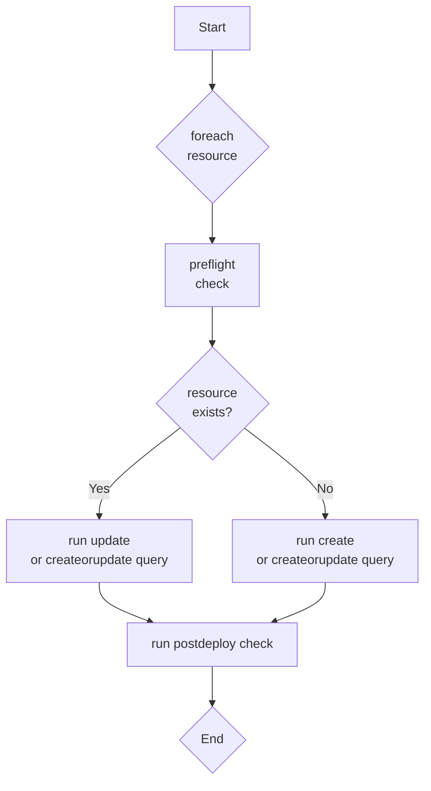

# stackql-deploy

**stackql-deploy** is a a multi-cloud Infrastructure as Code (IaC) framework using [__`stackql`__](https://github.com/stackql/stackql) inspired by dbt (data build tool) but designed for multi-cloud resource management.  

**stackql-deploy** provides a single codebase to manage resources across multiple environments and cloud providers using a SQL-like grammar. Features include:

- dynamic state determination (eliminating the need for state files)
- simple flow control with rollback capabilities
- single code base for multiple target environments
- SQL based definitions for resources and tests

## How stackql-deploy Works

**stackql-deploy** orchestrates cloud resource provisioning by parsing SQL-like definitions. It determines the necessity of creating or updating resources based on preflight checks, and ensures the creation and correct desired configuration through post-deployment verifications. 



## Project Structure

**stackql-deploy** uses a modular structure where each component of the infrastructure is defined in separate files, allowing for clear separation of concerns and easy management.  This example is based on a stack named `activity_monitor`, with a resource named `monitor_resource_group`.

```
├── activity_monitor
│   ├── stackql_manifest.yml
│   ├── stackql_docs
│   │   └── monitor_resource_group.md
│   ├── stackql_resources
│   │   └── monitor_resource_group.iql
│   └── stackql_tests
│       └── monitor_resource_group.iql
```

## Manifest File

The `stackql_manifest.yml` is the stack deployment configuration, specifying the cloud providers, global variables, and resources to manage.

```yaml
version: 1
name: activity_monitor
description: OSS activity monitor stack
providers:
  - azure
globals:
  - name: SUBSCRIPTION_ID
    description: Azure subscription ID
    value: "{{ vars.AZURE_SUBSCRIPTION_ID }}"
  - name: LOCATION
    value: eastus
resources:
  - name: monitor_resource_group
    description: Azure resource group for activity monitor
    props:
      - name: location
        description: Azure resource group location
        value: "{{ globals.LOCATION }}"
      - name: subscription_id
        description: Azure subscription ID
        value: "{{ globals.SUBSCRIPTION_ID }}"
      - name: resource_group_name
        description: Azure resource group name
        value: "activity-monitor-{{ globals.environment }}"
```

## Resource and Test SQL Files

These files define the SQL-like commands for creating, updating, and testing the deployment of resources.

**Resource SQL (stackql_resources/monitor_resource_group.iql):**

```sql
/*+ create */
INSERT INTO azure.resources.resource_groups(
  resourceGroupName,
  subscriptionId,
  data__location
)
SELECT
  '{{ resource_group_name }}',
  '{{ subscription_id }}',
  '{{ location }}'

/*+ update */
UPDATE azure.resources.resource_groups
SET data__location = '{{ location }}'
WHERE resourceGroupName = '{{ resource_group_name }}'
  AND subscriptionId = '{{ subscription_id }}'

/*+ delete */
DELETE FROM azure.resources.resource_groups 
WHERE resourceGroupName = '{{ resource_group_name }}' AND subscriptionId = '{{ subscription_id }}'
```

**Test SQL (stackql_tests/monitor_resource_group.iql):**

```sql
/*+ preflight */
SELECT COUNT(*) as count FROM azure.resources.resource_groups
WHERE subscriptionId = '{{ subscription_id }}'
AND resourceGroupName = '{{ resource_group_name }}'

/*+ postdeploy, retries=5, retry_delay=5 */
SELECT COUNT(*) as count FROM azure.resources.resource_groups
WHERE subscriptionId = '{{ subscription_id }}'
AND resourceGroupName = '{{ resource_group_name }}'
AND location = '{{ location }}'
AND JSON_EXTRACT(properties, '$.provisioningState') = 'Succeeded'
```

## Building and Testing Locally

To get started with **stackql-deploy**, install it locally using pip:

```bash
pip install -e .
```

`deploy`, `test`, or `teardown` stacks for environments using:

```bash
stackql-deploy deploy prd activity_monitor -e AZURE_SUBSCRIPTION_ID 00000000-0000-0000-0000-000000000000 --dry-run
stackql-deploy deploy prd activity_monitor -e AZURE_SUBSCRIPTION_ID 00000000-0000-0000-0000-000000000000
stackql-deploy test prd activity_monitor -e AZURE_SUBSCRIPTION_ID 00000000-0000-0000-0000-000000000000
stackql-deploy teardown prd activity_monitor -e AZURE_SUBSCRIPTION_ID 00000000-0000-0000-0000-000000000000
```

additional options include:

- `--dry-run`: perform a dry run of the stack operations.
- `--on-failure=rollback`: action on failure: rollback, ignore or error.
- `--env-file=.env`: specify an environment variable file.
- `-e KEY=value`: pass additional environment variables.
- `--log-level` : logging level (DEBUG, INFO, WARNING, ERROR, CRITICAL), defaults to INFO.

**stackql-deploy** simplifies cloud resource management by treating infrastructure as flexible, dynamically assessed code..