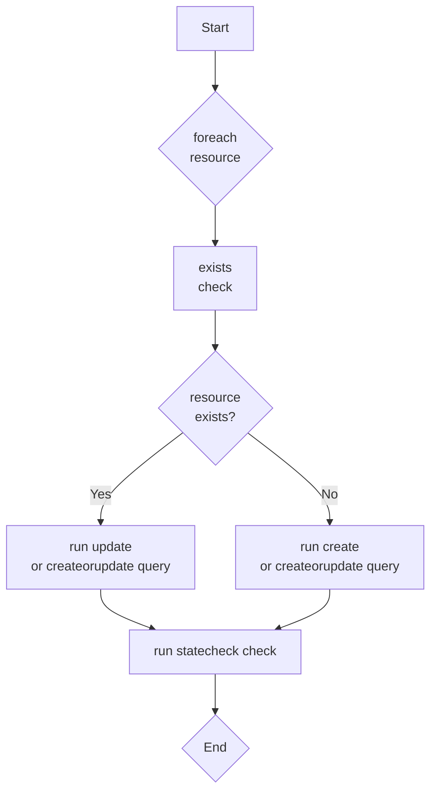

<!-- web assets -->

[logo]: https://stackql.io/img/stackql-logo-bold.png "stackql logo"
[deploylogo]: https://stackql.io/img/stackql-deploy-logo.png "stackql-deploy logo"
[stackqlrepo]: https://github.com/stackql/stackql
[homepage]: https://stackql.io/
[docs]: https://stackql.io/docs
[blog]: https://stackql.io/blog
[registry]: https://github.com/stackql/stackql-provider-registry

<!-- [readthedocs]: -->

[pypi]: https://pypi.org/project/stackql-deploy/

<!-- badges -->

[badge1]: https://img.shields.io/badge/platform-windows%20macos%20linux-brightgreen "Platforms"
[badge2]: https://img.shields.io/pypi/v/stackql-deploy "PyPi Version"
[badge3]: https://img.shields.io/pypi/dm/stackql-deploy "PyPi Downloads"
[badge4]: https://img.shields.io/github/license/stackql/stackql "License"

<!-- github links -->

[discussions]: https://github.com/orgs/stackql/discussions
[issues]: https://github.com/stackql/stackql-deploy/issues/new/choose

<!-- misc links -->

[twitter]: https://twitter.com/stackql

<!-- language: lang-none -->
<div align="center">

[![logo]][stackqlrepo]  
![badge1]
![badge2]
![badge3]
![badge4]

</div>
<div align="center">

### Model driven resource provisioning and deployment framework using StackQL.

<p align="center">

<!-- [__Read the docs »__][readthedocs]   -->

[**PyPi**][pypi]
[**Raise an Issue**][issues]

</p>
</div>

## About The Project

[**`stackql-deploy`**][pypi] is an open-source command line utility which implements a declarative, model driven framework to deploy and manage multi cloud stacks using [**`stackql`**][stackqlrepo]. [**`stackql-deploy`**][pypi] is distributed as a Python script to be used as a CLI tool, do the following to get started:
<br />

```bash
pip install stackql-deploy
```

> **Note for macOS users**  
> to install `stackql-deploy` in a virtual environment (which may be necessary on **macOS**), use the following:
>
> ```bash
> python3 -m venv myenv
> source myenv/bin/activate
> pip install stackql-deploy
> ```

## About StackQL

StackQL is a utility which allows you to query and interact with cloud and SaaS resources in real time using SQL grammar. StackQL supports a full set of SQL query/DML grammar, including `JOIN`, `UNION` adn subquery functionality and supports mutation operations on cloud and SaaS resources such as `create`, `update` and `delete`, implemented as `INSERT`, `UPDATE` and `DELETE` respectively. StackQL also supports grammar for performing lifecycle operations such as starting or stopping a VM using the `EXEC` statement.

StackQL provider definitions are defined in plaintext OpenAPI extensions to the providers specification. These definitions are then used to generate the SQL schema and the API client. The source for the provider definitions are stored in the [**StackQL Registry**][registry].

## How it works

<!-- > see [__readthedocs__]() for more detailed documentation -->

A **`stackql-deploy`** project is a directory containing StackQL scripts with a manifest file at the root of the directory, for example:

```
├── example_stack
│   ├── resources
│   │   └── monitor_resource_group.iql
│   ├── stackql_manifest.yml
```

the `stackql_manifest.yml` defines the resources in the stackql with their properties which can be scoped by environments, for example:

```yaml
version: 1
name: example_stack
description: oss activity monitor stack
providers:
    - azure
globals:
    - name: subscription_id
    description: azure subscription id
    value: "{{ vars.AZURE_SUBSCRIPTION_ID }}"
    - name: location
    value: eastus
    - name: resource_group_name_base
    value: "activity-monitor"
resources:
    - name: monitor_resource_group
    description: azure resource group for activity monitor
    props:
        - name: resource_group_name
        description: azure resource group name
        value: "{{ globals.resource_group_name_base }}-{{ globals.stack_env }}"
        # OR YOU CAN DO...
        # values:
        #   prd:
        #     value: "activity-monitor-prd"
        #   sit:
        #     value: "activity-monitor-sit"
        #   dev:
        #     value: "activity-monitor-dev"
```

> use `stackql-deploy init {stack_name}` to create a project directory with sample files

Deployment orchestration using `stackql-deploy` includes:

- **_pre-flight_** checks, which are StackQL queries that check for the existence or current configuration state of a resource
- **_deployment_** scripts, which are StackQL queries to create or update resoruces (or delete in the case of de-provisioning)
- **_post-deployment_** tests, which are StackQL queries to confirm that resources were deployed and have the desired state

This process is described here:



### `INSERT`, `UPDATE`, `DELETE` queries

Mutation operations are defined as `.iql` files in the `resources` directory, these are templates that are rendered with properties or environment context variables at run time, for example:

```sql
/*+ create */
INSERT INTO azure.resources.resource_groups(
    resourceGroupName,
    subscriptionId,
    data__location
)
SELECT
    '{{ resource_group_name }}',
    '{{ subscription_id }}',
    '{{ location }}'

/*+ update */
UPDATE azure.resources.resource_groups
SET data__location = '{{ location }}'
WHERE resourceGroupName = '{{ resource_group_name }}'
    AND subscriptionId = '{{ subscription_id }}'

/*+ delete */
DELETE FROM azure.resources.resource_groups
WHERE resourceGroupName = '{{ resource_group_name }}' AND subscriptionId = '{{ subscription_id }}'
```

### Test Queries

Test files are defined as `.iql` files in the `resources` directory, these files define the per-flight and post-deploy checks to be performed, for example:

```sql
/*+ exists */
SELECT COUNT(*) as count FROM azure.resources.resource_groups
WHERE subscriptionId = '{{ subscription_id }}'
AND resourceGroupName = '{{ resource_group_name }}'

/*+ statecheck, retries=5, retry_delay=5 */
SELECT COUNT(*) as count FROM azure.resources.resource_groups
WHERE subscriptionId = '{{ subscription_id }}'
AND resourceGroupName = '{{ resource_group_name }}'
AND location = '{{ location }}'
AND JSON_EXTRACT(properties, '$.provisioningState') = 'Succeeded'
```

## Usage

<!-- > see [__readthedocs__]() for more detailed documentation -->

Once installed, use the `build`, `test`, or `teardown` commands as shown here:

```
stackql-deploy build prd example_stack -e AZURE_SUBSCRIPTION_ID 00000000-0000-0000-0000-000000000000 --dry-run
stackql-deploy build prd example_stack -e AZURE_SUBSCRIPTION_ID 00000000-0000-0000-0000-000000000000
stackql-deploy test prd example_stack -e AZURE_SUBSCRIPTION_ID 00000000-0000-0000-0000-000000000000
stackql-deploy teardown prd example_stack -e AZURE_SUBSCRIPTION_ID 00000000-0000-0000-0000-000000000000
```

> **Note:** `teardown` deprovisions resources in reverse order to creation

Additional options include:

- `--dry-run`: perform a dry run of the stack operations.
- `--on-failure=rollback`: action on failure: rollback, ignore or error.
- `--env-file=.env`: specify an environment variable file.
- `-e KEY=value`: pass additional environment variables.
- `--log-level`: logging level (DEBUG, INFO, WARNING, ERROR, CRITICAL), defaults to INFO.

Use `stackql-deploy info` to show information about the package and environment, for example:

```bash
$ stackql-deploy info
stackql-deploy CLI
  Version: 1.7.7

StackQL Library
  Version: v0.5.748
  pystackql Version: 3.7.0
  Platform: Linux x86_64 (Linux-5.15.133.1-microsoft-standard-WSL2-x86_64-with-glibc2.35), Python 3.10.12
  Binary Path: `/mnt/c/LocalGitRepos/stackql/stackql-deploy/stackql`

Installed Providers
  aws: v24.07.00246
  azure: v23.03.00121
  google: v24.09.00251
```

Use the `--help` option to see more information about the commands and options available:

```
stackql-deploy --help
```

## Building and Testing Locally

To get started with **stackql-deploy**, install it locally using pip:

```bash
python3 -m venv venv
source venv/bin/activate
pip install -e .
# ...
deactivate
rm -rf venv/
```

### To Remove the Locally Installed Package

```
pip uninstall stackql-deploy
pip cache purge
```

## Building and Deploying to PyPI

To distribute **stackql-deploy** on PyPI, you'll need to ensure that you have all required files set up correctly in your project directory. This typically includes your `setup.py`, `README.rst`, `LICENSE`, and any other necessary files.

### Building the Package

First, ensure you have the latest versions of `setuptools` and `wheel` installed:

```bash
python3 -m venv venv
source venv/bin/activate
# pip install --upgrade setuptools wheel
pip install --upgrade build
```

Then, navigate to your project root directory and build the distribution files:

```bash
rm dist/stackql_deploy*
python3 -m build
# or
# python3 setup.py sdist bdist_wheel
```

This command generates distribution packages in the `dist/` directory.

### Uploading the Package to PyPI

To upload the package to PyPI, you'll need to use `twine`, a utility for publishing Python packages. First, install `twine`:

```
pip install twine
```

Then, use `twine` to upload all of the archives under `dist/`:

```
twine upload --config-file .pypirc dist/*
```

### Building the Docs

Navigate to your `docs` directory and build the Sphinx documentation:

```
cd docs
make html
```

## Code Linting

To maintain code quality and consistency, we use `ruff` as the linter for this project. `ruff` offers fast performance and a comprehensive set of linting rules suitable for `stackql-deploy`. You can run the lint check as follows:

```bash
ruff check .
```

Note: If you need to install ruff, you can do so with `pip install ruff`.

## Contributing

Contributions are welcome and encouraged.

## License

Distributed under the MIT License. See [`LICENSE`](https://github.com/stackql/stackql-deploy/blob/main/LICENSE) for more information.

## Contact

Get in touch with us via Twitter at [**@stackql**][twitter], email us at [**info@stackql.io**](info@stackql.io) or start a conversation using [**discussions**][discussions].
